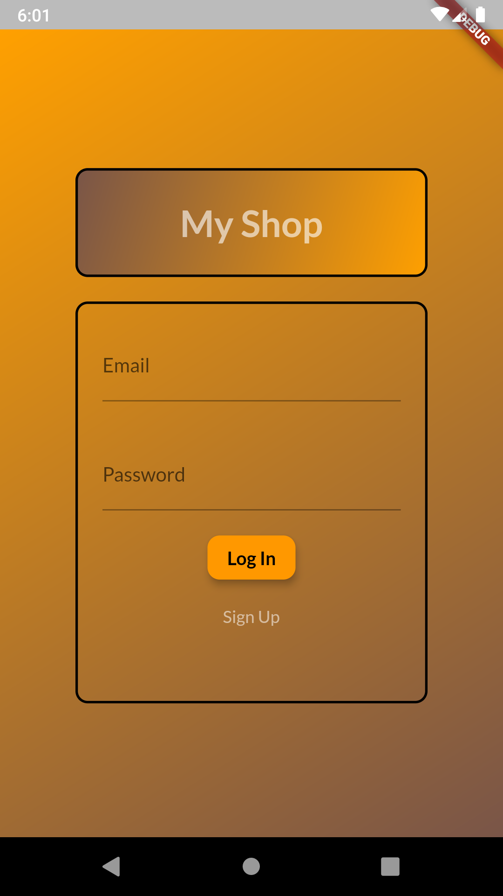
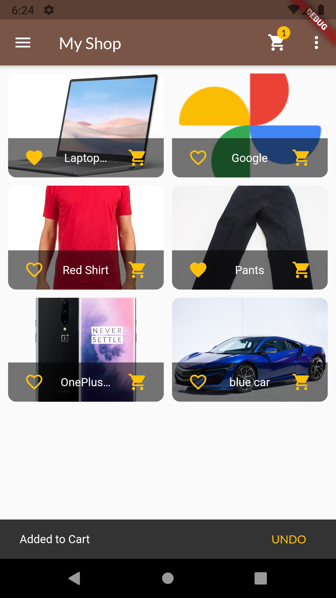
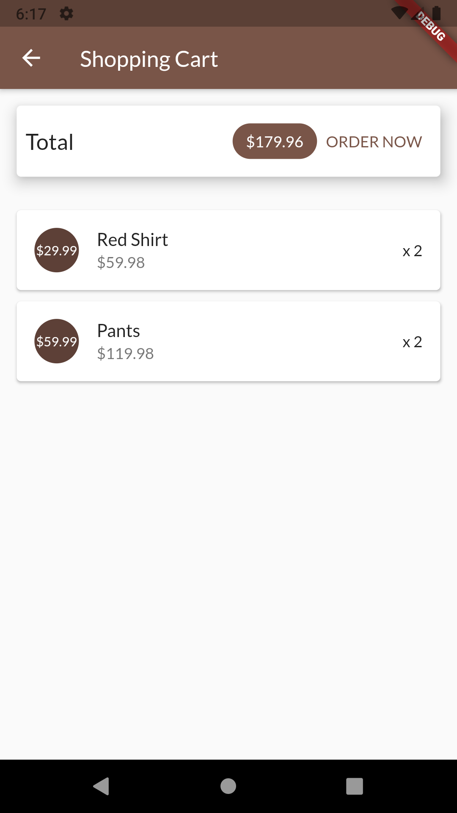
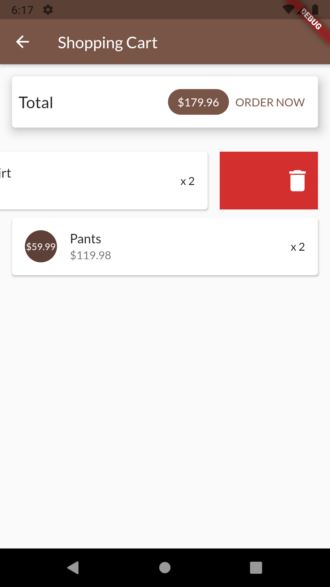
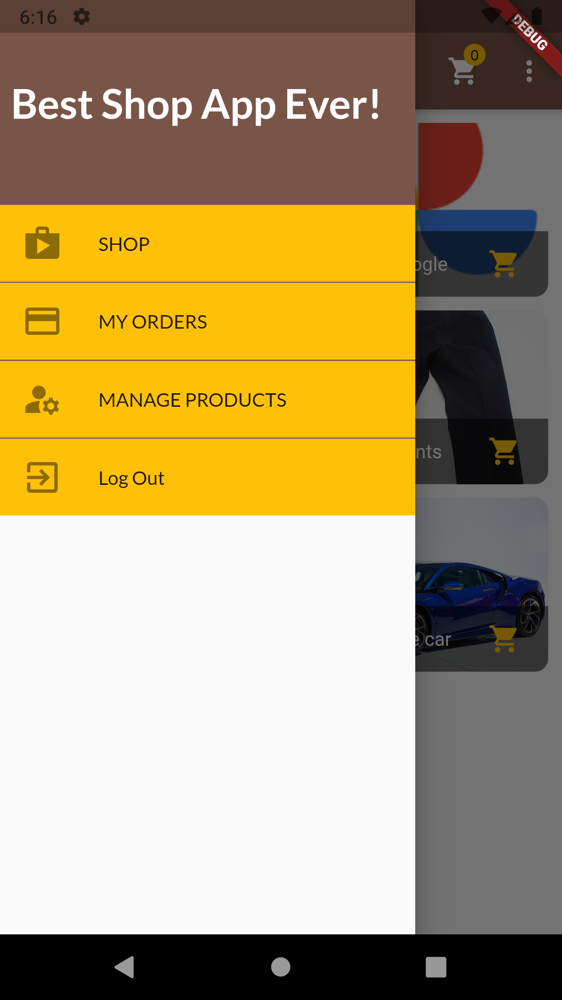
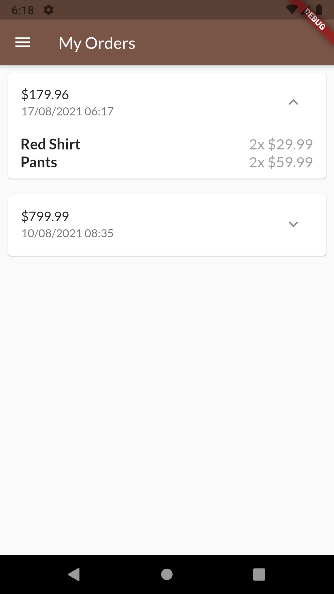
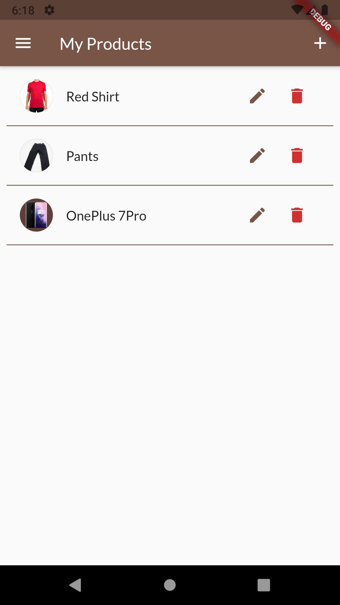
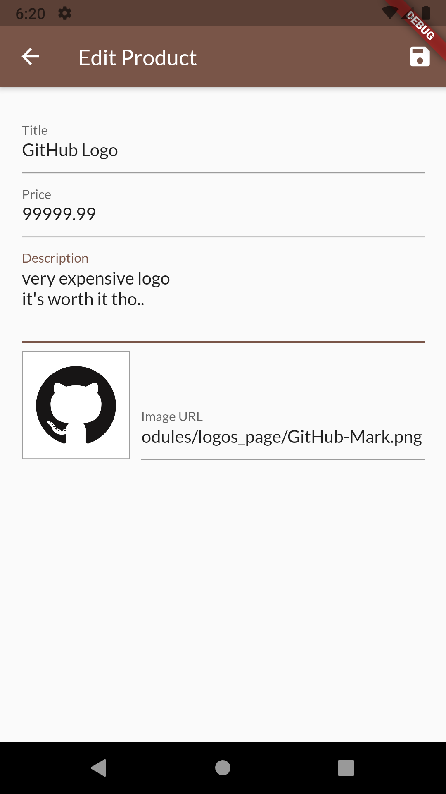

# shop_app

A Cross Platform application built using Flutter/Dart for the front-end and  
and FireBase for the back-end to store user's data and authentication

#APP DEMO 

Log in screen, where user can log in using their email and password or create a new account  
Authentication happens using FireBase
 

 
This is the main screen of the app where users can add product to their shopping cart  
or favorite them so they can view them in a seperate screen
 

 
Users also have the option to undo adding to shopping cart 
  

  
In the shopping cart, users are allowed to place orders and swipe to remove items <bs>they no longer want to purchase.
 

 
Users can navigate through different pages of the app using a drawer that slides from the side
 

 
Users can view their orders and expand them to view their details  
like what items they ordered and how much each costs
 

 
Users can also view product they have added, update them and delete them if needed
 

 
the following screen allow user's to edit or add new products. 
it validates user's input for each field and show an image overview  
for the image URL used (if valid)

 
